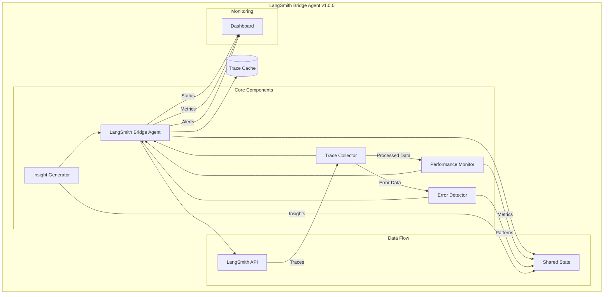
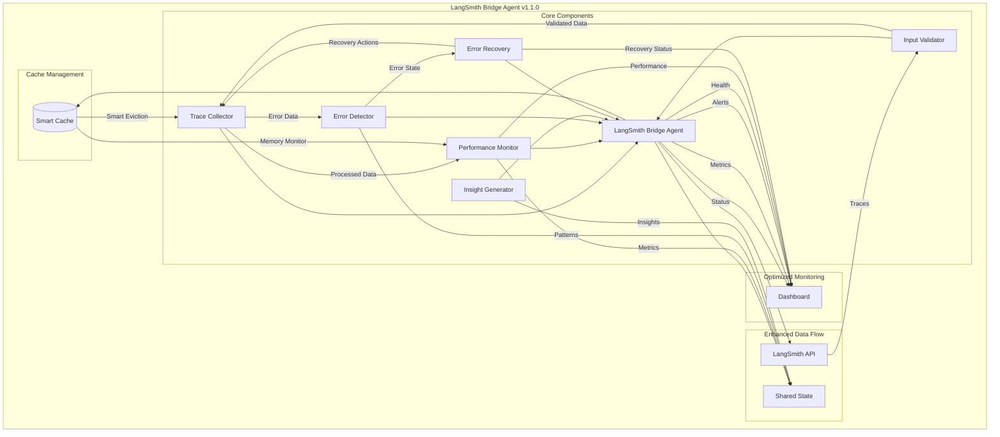
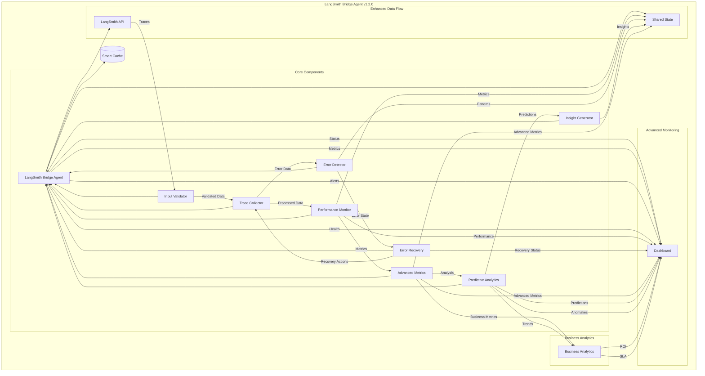
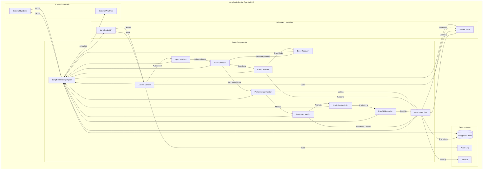
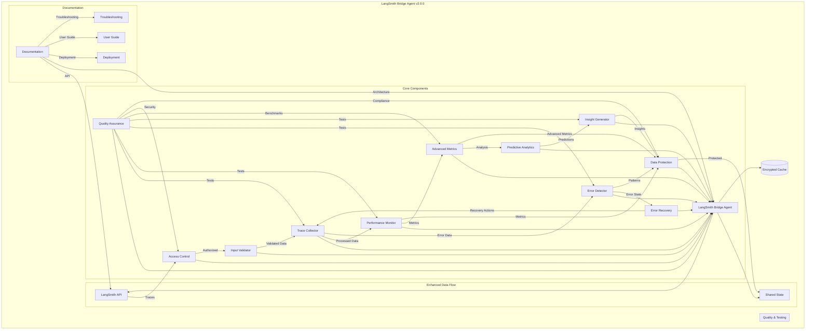

# LangSmith Bridge Agent Architecture

## Current Architecture (v1.0.0)

### Component Diagram


### LangGraph Schema (Current)
```python
{
    "nodes": {
        "trace_collector": {
            "type": "collector",
            "config": {
                "polling_interval": 30,
                "batch_size": 15,
                "max_age_hours": 24
            },
            "outputs": ["trace_processor"]
        },
        "trace_processor": {
            "type": "processor",
            "config": {
                "deduplication": true,
                "validation": "basic"
            },
            "outputs": ["performance_monitor", "error_detector"]
        },
        "performance_monitor": {
            "type": "monitor",
            "config": {
                "metrics": ["speed", "error_rate", "memory"]
            },
            "outputs": ["shared_state"]
        },
        "error_detector": {
            "type": "detector",
            "config": {
                "patterns": true,
                "categorization": "basic"
            },
            "outputs": ["shared_state", "insight_generator"]
        },
        "insight_generator": {
            "type": "generator",
            "config": {
                "types": ["performance", "error", "optimization"]
            },
            "outputs": ["shared_state"]
        }
    }
}
```

## Phase 1: Stability & Reliability (Q2 2024)

### Enhanced Architecture


### LangGraph Schema (Phase 1)
```python
{
    "nodes": {
        "input_validator": {
            "type": "validator",
            "config": {
                "schemas": "strict",
                "type_checking": true,
                "custom_exceptions": true
            },
            "outputs": ["trace_collector"]
        },
        "trace_collector": {
            "type": "collector",
            "config": {
                "polling_interval": 30,
                "batch_size": "auto",
                "max_age_hours": 24,
                "retry_strategy": "exponential_backoff"
            },
            "outputs": ["trace_processor"]
        },
        "error_recovery": {
            "type": "recovery",
            "config": {
                "circuit_breaker": true,
                "backoff_strategy": "exponential",
                "state_persistence": true
            },
            "outputs": ["trace_collector", "shared_state"]
        },
        "trace_processor": {
            "type": "processor",
            "config": {
                "deduplication": "smart",
                "validation": "strict",
                "parallel_processing": true
            },
            "outputs": ["performance_monitor", "error_detector"]
        },
        "performance_monitor": {
            "type": "monitor",
            "config": {
                "metrics": ["speed", "error_rate", "memory", "cpu", "io"],
                "benchmarking": true,
                "auto_tuning": true
            },
            "outputs": ["shared_state"]
        },
        "error_detector": {
            "type": "detector",
            "config": {
                "patterns": "advanced",
                "categorization": "detailed",
                "impact_analysis": true
            },
            "outputs": ["shared_state", "insight_generator", "error_recovery"]
        }
    }
}
```

## Phase 2: Enhanced Monitoring (Q3 2024)

### Advanced Monitoring Architecture


### LangGraph Schema (Phase 2)
```python
{
    "nodes": {
        "advanced_metrics": {
            "type": "metrics",
            "config": {
                "system_health": {
                    "cpu": true,
                    "memory": true,
                    "disk_io": true,
                    "network": true
                },
                "performance": {
                    "trends": true,
                    "baselines": true,
                    "anomalies": true
                },
                "business": {
                    "impact": true,
                    "cost": true,
                    "roi": true,
                    "sla": true
                }
            },
            "outputs": ["predictive_analytics", "shared_state"]
        },
        "predictive_analytics": {
            "type": "analytics",
            "config": {
                "trend_analysis": true,
                "anomaly_detection": true,
                "forecasting": true,
                "pattern_recognition": true
            },
            "outputs": ["insight_generator", "dashboard"]
        },
        "alert_system": {
            "type": "alerter",
            "config": {
                "levels": ["info", "warning", "critical"],
                "routing": true,
                "aggregation": true,
                "history": true
            },
            "outputs": ["dashboard", "shared_state"]
        }
    }
}
```

## Phase 3: Integration & Security (Q4 2024)

### Secure Integration Architecture


### LangGraph Schema (Phase 3)
```python
{
    "nodes": {
        "access_control": {
            "type": "security",
            "config": {
                "authentication": {
                    "api_key_rotation": true,
                    "rbac": true,
                    "mfa": true
                },
                "authorization": {
                    "roles": ["admin", "operator", "viewer"],
                    "permissions": "granular"
                },
                "audit": {
                    "logging": true,
                    "monitoring": true
                }
            },
            "outputs": ["api", "shared_state"]
        },
        "data_protection": {
            "type": "security",
            "config": {
                "encryption": {
                    "at_rest": true,
                    "in_transit": true
                },
                "masking": {
                    "sensitive_data": true,
                    "pii": true
                },
                "retention": {
                    "policies": true,
                    "backup": true
                }
            },
            "outputs": ["shared_state", "cache"]
        },
        "external_integration": {
            "type": "integration",
            "config": {
                "export": {
                    "formats": ["json", "csv", "api"],
                    "validation": true
                },
                "import": {
                    "validation": true,
                    "transformation": true
                },
                "analytics": {
                    "third_party": true,
                    "custom": true
                }
            },
            "outputs": ["external_systems", "analytics"]
        }
    }
}
```

## Phase 4: Documentation & Testing (Q1 2025)

### Final Architecture


### LangGraph Schema (Phase 4)
```python
{
    "nodes": {
        "quality_assurance": {
            "type": "testing",
            "config": {
                "unit_tests": {
                    "coverage": ">90%",
                    "automated": true
                },
                "integration_tests": {
                    "end_to_end": true,
                    "performance": true
                },
                "security_tests": {
                    "penetration": true,
                    "compliance": true
                },
                "benchmarks": {
                    "performance": true,
                    "reliability": true
                }
            },
            "outputs": ["documentation", "deployment"]
        },
        "documentation": {
            "type": "docs",
            "config": {
                "technical": {
                    "architecture": true,
                    "api": true,
                    "code": true
                },
                "user": {
                    "guides": true,
                    "troubleshooting": true,
                    "best_practices": true
                },
                "deployment": {
                    "setup": true,
                    "configuration": true,
                    "maintenance": true
                }
            },
            "outputs": ["user_guide", "api_docs", "deployment_guide"]
        }
    }
}
```

## Architecture Evolution Summary

### Key Changes by Phase

1. **Phase 1 (v1.1.0)**
   - Added Input Validator
   - Enhanced Error Recovery
   - Implemented Smart Cache
   - Added Parallel Processing
   - Introduced Auto-tuning

2. **Phase 2 (v1.2.0)**
   - Added Advanced Metrics
   - Introduced Predictive Analytics
   - Enhanced Business Analytics
   - Implemented Advanced Alerting
   - Added Trend Analysis

3. **Phase 3 (v1.3.0)**
   - Added Access Control
   - Implemented Data Protection
   - Enhanced External Integration
   - Added Audit Logging
   - Introduced Backup Systems

4. **Phase 4 (v2.0.0)**
   - Added Quality Assurance
   - Comprehensive Documentation
   - Automated Testing
   - Performance Benchmarks
   - Security Compliance

### Migration Paths
Each phase builds upon the previous one, with clear upgrade paths and backward compatibility maintained throughout the evolution. The architecture diagrams show the incremental changes and new components added in each phase. 