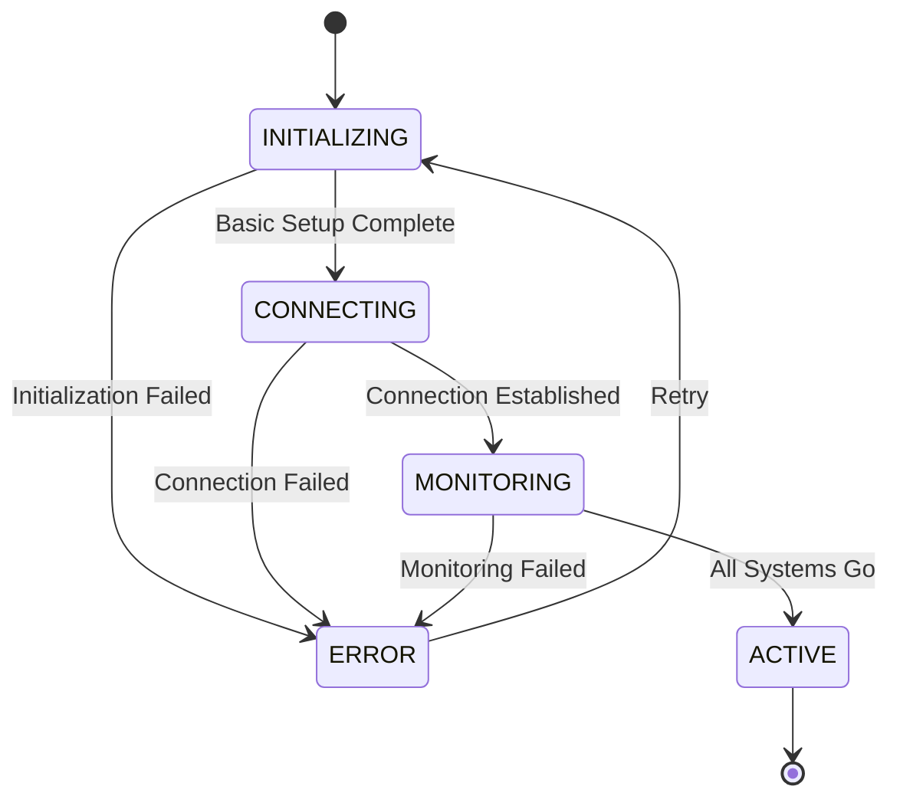
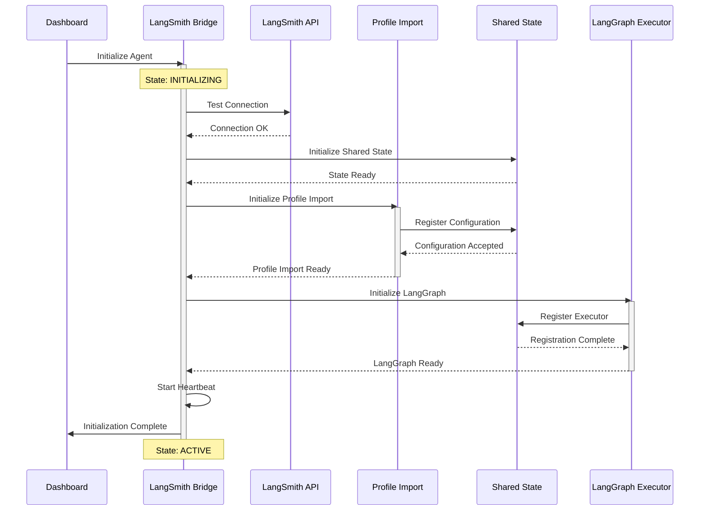
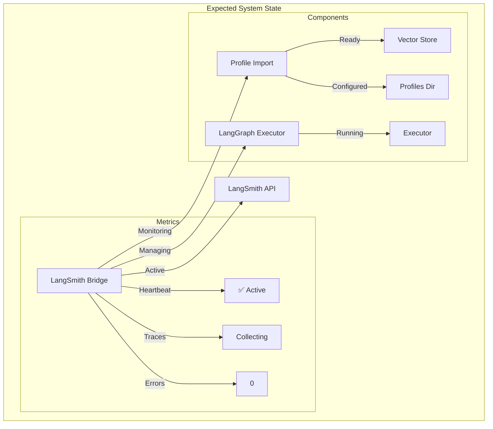

# LangSmith Bridge Agent Initialization Process

## Current State


## Required Initialization Sequence


## Required Actions

1. **LangSmith Bridge Agent Initialization**
   ```python
   # Required Configuration
   {
       "langsmith_api_key": "YOUR_API_KEY",
       "project_name": "import-pipeline-testing",
       "session_name": "dashboard-session-20250615-190703",
       "polling_interval": 30,
       "trace_batch_size": 15,
       "enable_tracing": true
   }
   ```

2. **Profile Import Executor Setup**
   ```python
   # Current Configuration (Verified)
   {
       "execution_interval": 120,
       "demo_mode": false,
       "max_profiles_per_cycle": 2,
       "main_vectorstore_path": "D:/DATA/vectorstore",
       "collection_name": "communications",
       "profiles_directory": "D:/GUI/2025-05-27/data/profiles",
       "batch_size": 3
   }
   ```

3. **System Health Checks Required**
   - [ ] Verify LangSmith API connectivity
   - [ ] Validate vector store access
   - [ ] Check profiles directory permissions
   - [ ] Confirm shared state initialization
   - [ ] Establish heartbeat mechanism
   - [ ] Initialize monitoring metrics

4. **Initialization Steps**
   1. Start LangSmith Bridge Agent
   2. Wait for connection establishment
   3. Initialize shared state
   4. Configure Profile Import Executor
   5. Start LangGraph Executor
   6. Begin heartbeat monitoring
   7. Start trace collection

## Expected State After Initialization



## Troubleshooting Guide

If initialization fails, check:

1. **Connection Issues**
   - Verify LangSmith API key
   - Check network connectivity
   - Validate API endpoint

2. **Resource Access**
   - Confirm vector store path exists
   - Verify profiles directory permissions
   - Check shared state database access

3. **Configuration**
   - Validate all required paths
   - Check batch size settings
   - Verify tracing configuration

4. **System Requirements**
   - Sufficient memory available
   - Required Python packages installed
   - Proper file system permissions

## Next Steps

1. **Immediate Actions**
   - Initialize LangSmith Bridge Agent
   - Monitor initialization logs
   - Verify component connections

2. **Post-Initialization**
   - Start trace collection
   - Begin profile import monitoring
   - Establish baseline metrics

3. **Monitoring Setup**
   - Configure alert thresholds
   - Set up performance baselines
   - Initialize error tracking

## Success Criteria

The system will be considered successfully initialized when:

1. LangSmith Bridge Agent shows:
   - State: ACTIVE
   - Heartbeat: ✅
   - Uptime: > 0s
   - Errors: 0

2. Profile Import Executor shows:
   - Business Logic Status: ✅ Available
   - Processing Mode: 🏭 Production
   - Configuration: Verified

3. System Metrics show:
   - System Health: 🟢 Healthy
   - Processing Speed: > 0 docs/sec
   - Memory Usage: < 80%
   - Active Agents: > 0 